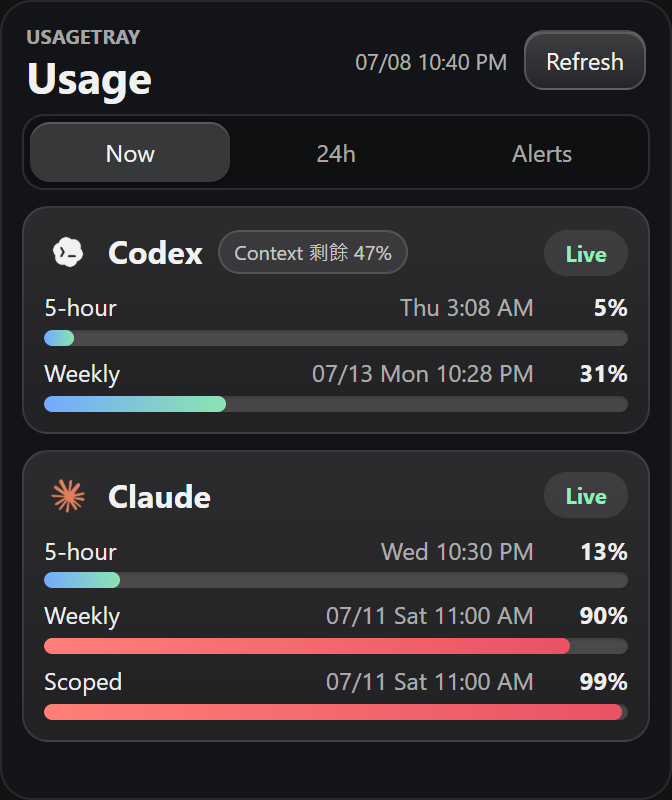
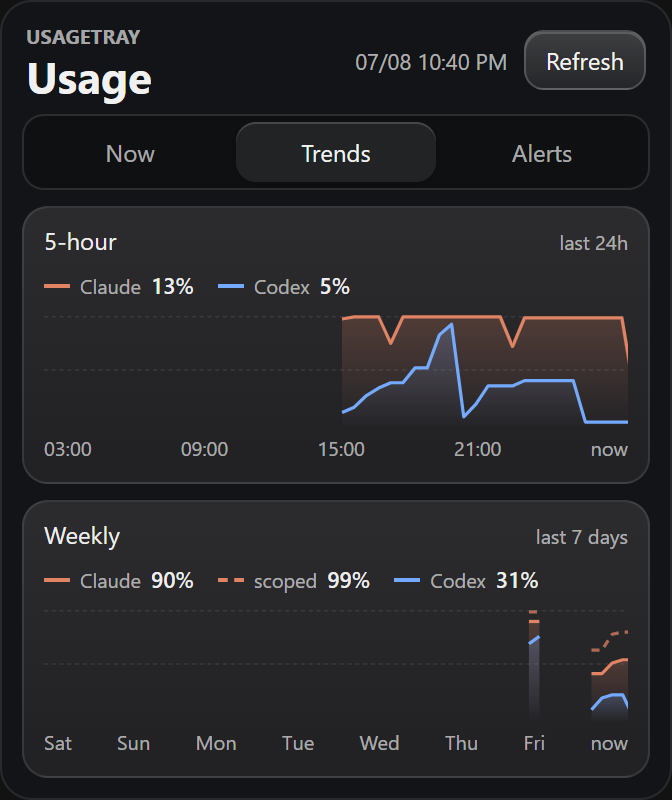
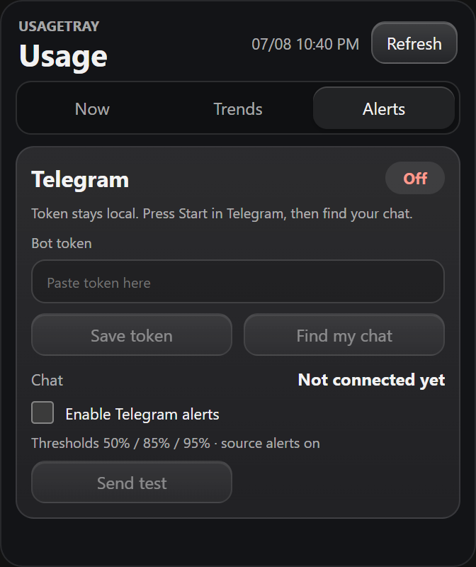

# UsageTray

一個 Windows 系統匣小工具，把 **Codex** 和 **Claude Code** 兩家的額度放在同一個面板：一眼看完用量與重置時間、快用完時 Telegram 主動提醒、Claude token 過期自動續期。

核心理念：**誰有用量就用誰**——訂閱了不只一家 AI coding agent 的人，額度調度不該靠自己記。

| Now | Trends | Alerts |
|---|---|---|
|  |  |  |

## 跟其他用量工具不一樣的地方

市面上的用量顯示工具大多只做單一家、只做「顯示」。UsageTray 的差異：

- **跨兩家**：Codex（5 小時＋每週）與 Claude Code（5 小時＋每週＋模型 Scoped）同框比較，額度調度一眼定案。
- **會主動找你，不用你去看**：用量跨過 50%／85%／95% 門檻時 Telegram 推播中文報表（含文字長條圖）；在手機上傳 `/usage` 給 bot 也能隨時反查目前用量——人不在電腦前也掌握額度。
- **Claude token 自動續期，連 CLI 一起受惠**：Claude Code 的 OAuth token 每 8 小時過期，UsageTray 自動用 refresh token 換新並「原子寫回」憑證檔（含並行競態防護與失敗冷卻），所以連 `claude` CLI 本身都不會再跳「請重新登入」。
- **資料不出門**：用量直接讀本機的 Codex app-server 與 Claude OAuth 憑證，不經第三方伺服器；bot token 用 Windows DPAPI 加密落地；所有輸出經過淨化，token 永不出現在 log 或訊息裡。
- **輕**：Tauri 打包，安裝檔 2.5 MB，常駐記憶體個位數 MB 等級。
- **歷史留檔可分析**：每一筆讀數都寫進本機 JSONL（`%APPDATA%\UsageTray\snapshots.jsonl`），要做用量習慣分析隨時有原始資料。

## 功能一覽

- 系統匣常駐，左鍵點圖示彈出面板；hover 顯示兩家 5 小時額度與剩餘時間；開機自動啟動。
- `Now`：Claude、Codex 各額度視窗的已用百分比、重置時間，即時刷新。
- `Trends`：兩張走勢圖——5 小時額度（近 24 小時）與每週額度（近 7 天）——Claude／Codex 同框疊圖對比，圖例帶目前值。
- `Alerts`：Telegram bot 設定（貼 token、自動偵測 chat、測試發送）與門檻推播。
- Telegram 雙向：跨門檻主動推播（同一輪多個門檻合併成一則）；傳 `/usage` 隨時反查（約 2 分鐘內回覆）。

## 系統需求

- Windows 10/11（x64）
- [Python 3.10+](https://www.python.org/downloads/)，且 `python` 在 PATH 中（收集器為純標準函式庫 Python 腳本，無需 pip 安裝套件）
- 至少安裝並登入其中一個：
  - [Codex CLI](https://github.com/openai/codex)（透過 `codex app-server` 讀額度）
  - [Claude Code](https://code.claude.com/docs/en/overview)（透過 OAuth 憑證查額度）

## 安裝

1. 從 [Releases](https://github.com/wakeuplate/usage-tray/releases) 下載最新的 `UsageTray_x.y.z_x64-setup.exe`（或自行建置，見下），執行安裝。
2. 從開始選單啟動 UsageTray，系統匣出現圖示；之後開機自動啟動。

### Telegram 警報設定（選用）

1. 跟 [@BotFather](https://t.me/BotFather) 建一個 bot，取得 bot token。
2. 對你的 bot 傳一則任意訊息。
3. 開 UsageTray 的 `Alerts` 分頁，貼上 token → `Find my chat` 自動偵測 → 勾選啟用。
4. Token 以 Windows DPAPI 加密存於 `%APPDATA%\UsageTray\`，不以明文落地。

## 從原始碼建置

需要 Rust（MSVC toolchain）、Node.js、Visual Studio C++ Build Tools 與 Windows SDK。詳細步驟見 [docs/WINDOWS-BUILD.md](docs/WINDOWS-BUILD.md)。

```powershell
cd app
npm install
npm run tauri build
# 產出：app/src-tauri/target/release/bundle/nsis/UsageTray_<版本>_x64-setup.exe
```

## 架構

- **外殼**：Tauri v2（Rust）＋ React/TypeScript 前端，336×400 無邊框視窗貼齊系統匣。
- **收集器**：`collectors/collect_usage_tray.py` 讀兩個資料來源、輸出淨化 JSON（契約見 [docs/COLLECTOR-CONTRACT.md](docs/COLLECTOR-CONTRACT.md)）：
  - Codex：本機 `codex app-server` 的 `account/rateLimits/read` JSON-RPC。
  - Claude：讀 `%USERPROFILE%\.claude\.credentials.json` 呼叫官方 usage API；過期自動 refresh 並原子寫回。
- **歷史**：`collectors/history_snapshot.py` 寫入 `%APPDATA%\UsageTray\snapshots.jsonl`（設計見 [docs/SNAPSHOT-HISTORY.md](docs/SNAPSHOT-HISTORY.md)）。
- **警報與指令**：`collectors/telegram_bridge.py` 處理門檻去重、推播與 `/usage` 回覆。

## 測試

```powershell
python collectors/test_collect_usage_tray_contract.py
```
